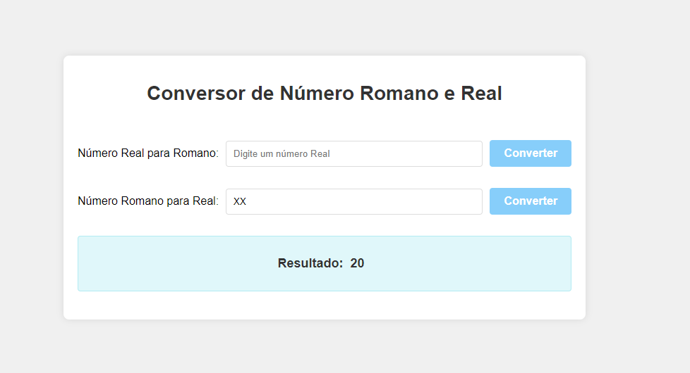

## Conversor de Número Romano e Real

O Conversor de Número Romano e Real é uma aplicação web que permite a conversão de número real para romano e conversão de número romano para real.<br>
A aplicação é responsiva, adaptando-se a diferentes tamanhos de tela para oferecer uma boa experiência em dispositivos móveis e desktop.

### Tecnologias Utilizadas

* Laravel Versão 11 - [Documentação do Laravel](https://laravel.com/docs/11.x)
* PHP Versão 8.3.10 - [Download do PHP](https://windows.php.net/download#php-8.3)
* Composer Versão 2.7.7 - [Site do Composer](https://getcomposer.org/)


### Configurar e executar a aplicação

Para configurar e executar a aplicação localmente, siga os passos abaixo:

1. Clone o Repositório: 

```bash
https://github.com/anapaulaguimaraes/Conversor-Numeros-Romanos-Real.git 
```

2. Instale as Dependências executando o comando no terminal: 

```bash 
composer install
```

3. Configure o Ambiente: 
```bash 
Renomeie o arquivo .env.example para .env e ajuste as configurações conforme necessário.
```

4. Inicie o Servidor de Desenvolvimento executando o comando no terminal: 

```bash  
php artisan serve
```

#### Veja como ficou o projeto:


### Conversor de Número Real para Romano


### Conversor de Número Romano para Real



### Conversor Responsivo para Dispositivos Móveis

